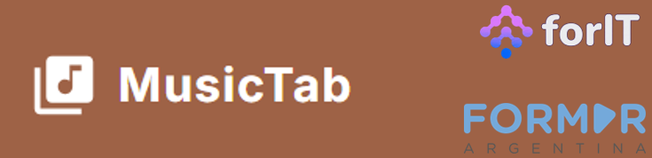
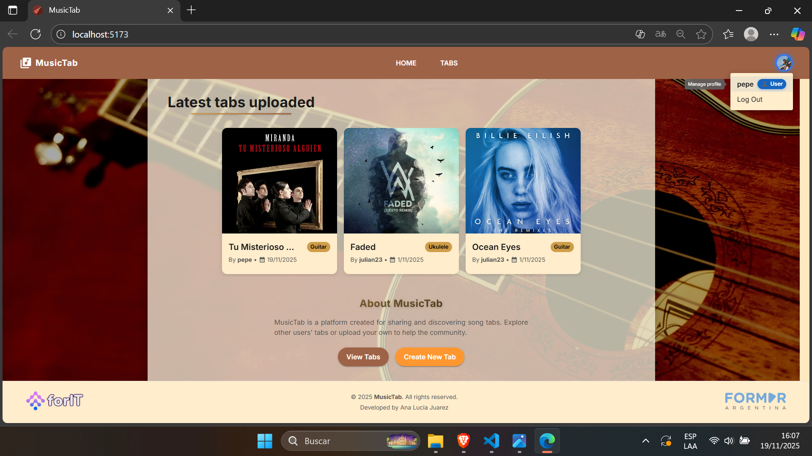
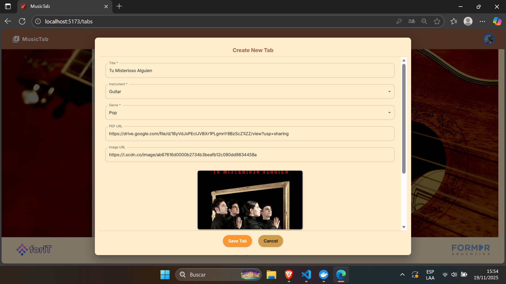
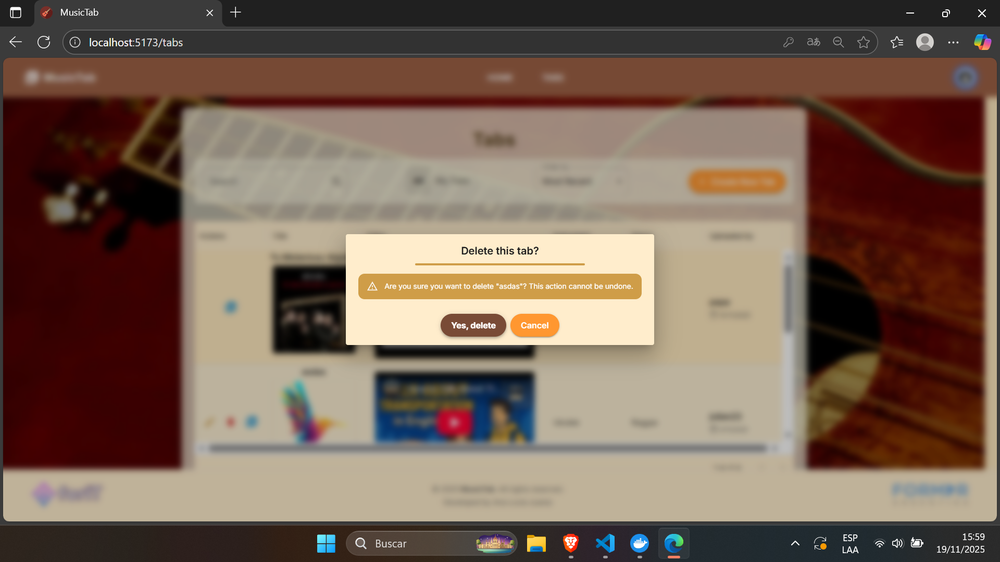
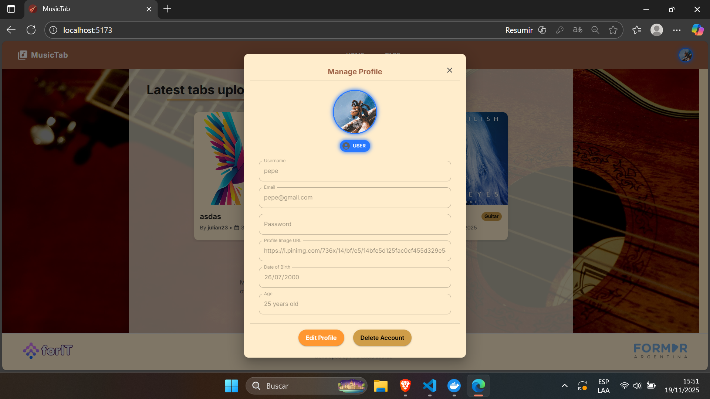
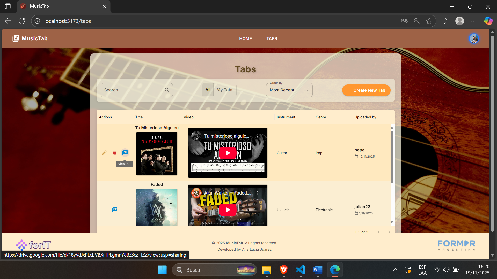
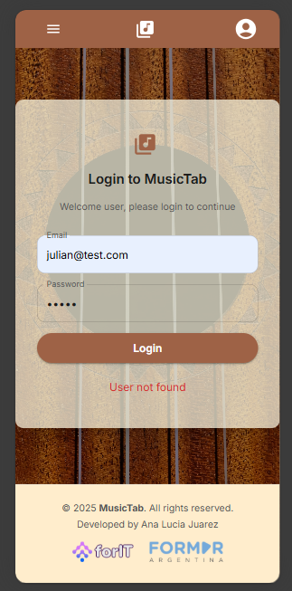

<section align="center">
    
</section>


## Index

* [Overview](#overview)
* [Technologies](#technologies)
* [Prerequisites](#prerequisites)
* [Project Installation](#project-installation)
    * [Running the Backend Locally](#running-the-backend-locally)
    * [Running Backend Tests](#running-backend-tests)
    * [Running the Frontend Locally](#running-the-frontend-locally)
    * [Running Frontend Tests](#running-frontend-tests)
    * [Running Storybook](#running-storybook)
* [Docker Setup](#docker-setup)
* [Main Features](#main-features)
* [Screenshots](#screenshots)
* [Author](#author)


## Overview
MusicTab is a **full-stack application** that allows users to browse, manage, and interact with tablature for different instruments.

It includes:

* A **NestJS backend** with **Prisma ORM**
* A **Vite + React frontend**
* A **SQLite database**
* A complete **Docker Compose environment** to run the whole system with a single command

## Technologies
## Backend
| Node.js | NestJS | TypeScript | Prisma ORM | SQLite | ts-node | Vitest |
|:--:|:--:|:--:|:--:|:--:|:--:|:--:|
|  |  |  |  |  |  |  |


## Frontend
| React | TypeScript | Vite | Material UI | Storybook | Vitest |
|:--:|:--:|:--:|:--:|:--:|:--:|
|  |  |  |  |  |  |

## DevOps
| Docker | Docker Compose |
|:--:|:--:|
|  |  |


## Prerequisites

Before installing or running the project, ensure you have:

### Required Tools
* **Node.js** ($\ge$ 18)
* **Yarn** or **npm**
* **Docker & Docker Compose**
* **Git**
* **A code editor** like **VS Code**

## Project Installation
### 1. Clone the repository
```bash
git clone https://github.com/manita02/MusicTab
cd MusicTab
```

### 2. Install root dependencies
```bash
yarn install
```

### 3. Install backend dependencies
```bash
cd apps/backend
npm install
```

### 4. Install frontend dependencies
```bash
cd ../frontend
yarn install
```

## Running the Backend Locally
From the project root:
```bash
npx ts-node --project apps/backend/tsconfig.json -r tsconfig-paths/register apps/backend/src/main.ts
```

The backend runs by default at: **http://localhost:3000**

## Running Backend Tests
```bash
yarn vitest run
```

## Running the Frontend Locally
```bash
cd apps/frontend
yarn dev
```

Frontend will be available at: **http://localhost:5173**

## Running Frontend Tests
```bash
cd apps/frontend
yarn test
```

## Running Storybook
```bash
cd apps/frontend
yarn storybook
```

## Docker Setup
The project includes a fully working `docker-compose.yaml` file that runs:

* **✔ Backend** (NestJS)
* **✔ Frontend** (Vite)
* **✔ SQLite database** (volume persisted)

### Build and run everything
```bash
docker-compose up --build
```

### Run without rebuilding
```bash
docker-compose up
```

### Stop all containers
```bash
docker-compose down
```

#### Services will be available at:

* **Frontend:** `http://localhost:5173`
* **Backend:** `http://localhost:3000`
* **Database file:** persisted in Docker volume `sqlite-data:/data`

## Main Features

- **User Authentication**
  - User **sign up** and **sign in**
  - Secure session handling

- **User Account Management**
  - Update account information
  - Delete user account
  - Upload and update profile image

- **Tabs Management (CRUD)**
  - Authenticated users can **create**, **edit**, and **delete** their own tabs
  - Tabs include YouTube link, preview image, PDF file, genre and instrument

- **Public Tabs Access**
  - Non-authenticated users can **browse** all tabs
  - Public users can **view** and **download** tablatures
  - Access to tab details without creating an account

- **Filtering & Categorization**
  - Tabs categorized by **genre** and **instrument**
  - User-specific tabs page

- **Responsive UI**
  - Desktop and mobile layout

- **Developer Experience**
  - API built with **NestJS + Prisma**
  - Frontend built with **React + Vite**
  - Storybook for isolated UI component development
  - Unit tests with **Vitest**
  - Fully Dockerized with **Docker Compose** for one-command startup

## Screenshots

### Desktop Views

| Home | New Tab | Delete Tab |
|:--:|:--:|:--:|
|  |  |  |

| Manage Users | Tabs Page | Sign In |
|:--:|:--:|:--:|
|  |  |  |


### Mobile View

| Mobile Login |
|:--:|
|  |


## Author
| [<br><sub>Ana Lucia Juarez</sub>](https://github.com/manita02) | 
| :---: |
