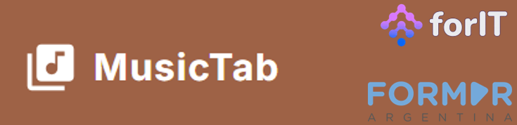
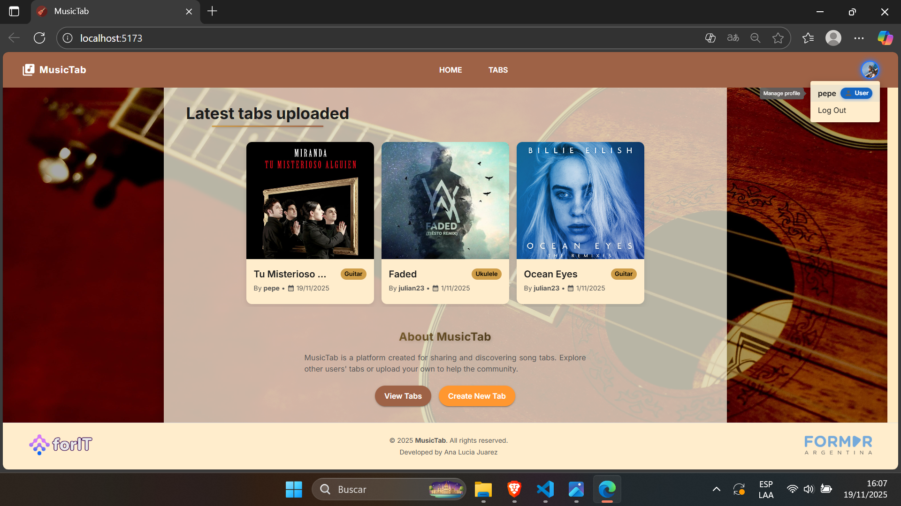
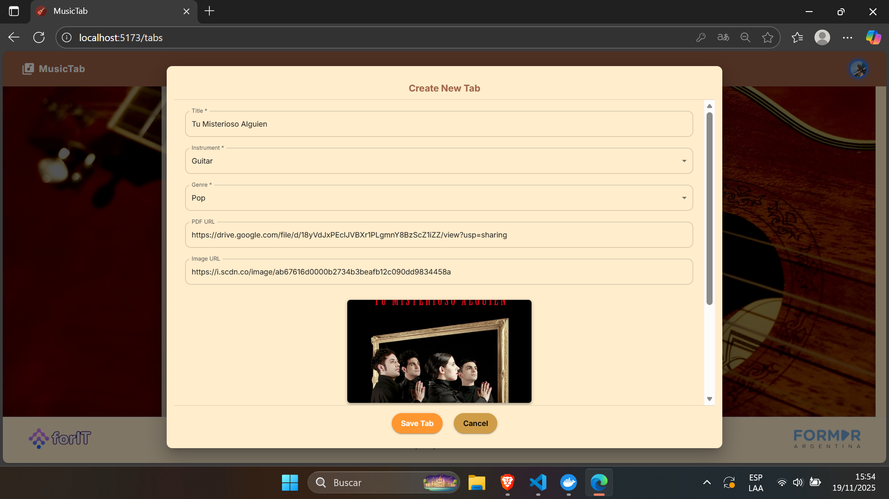
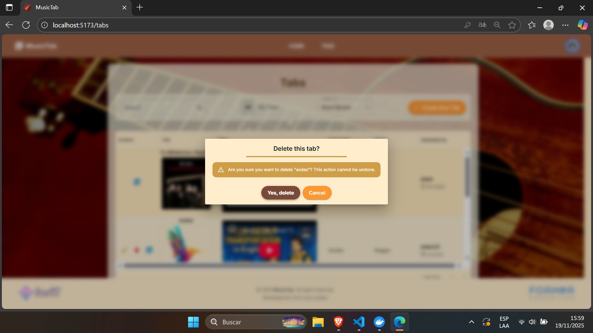
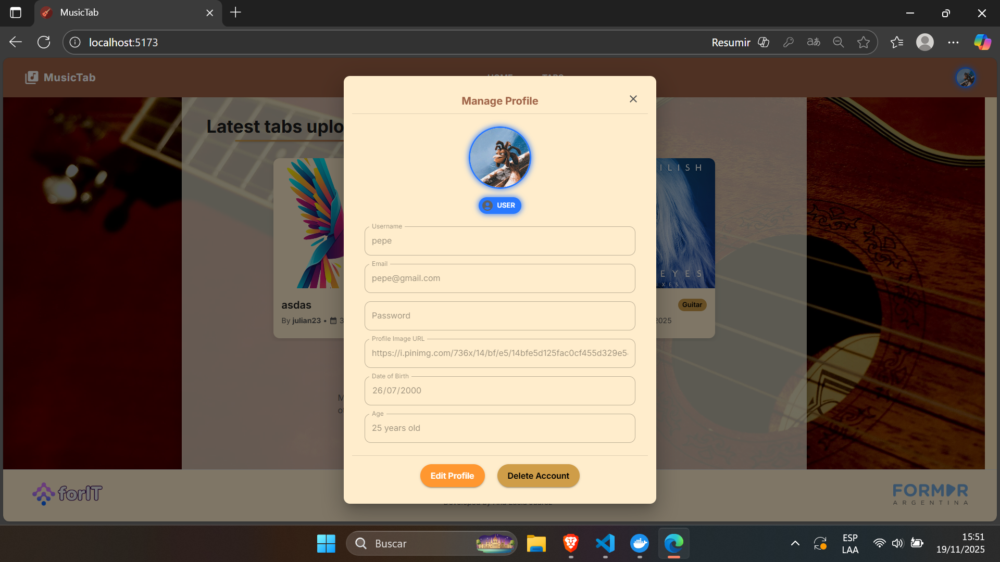
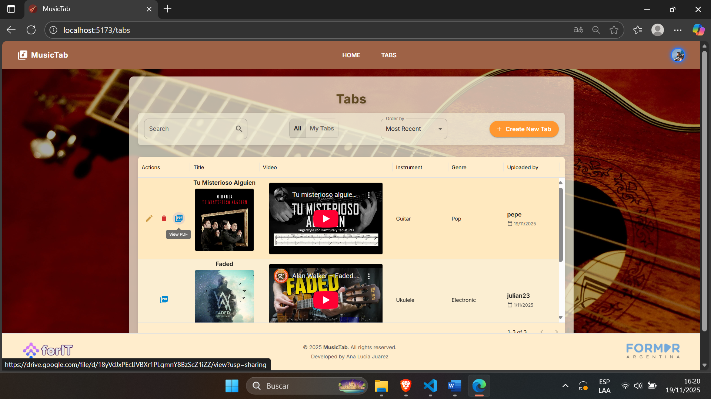
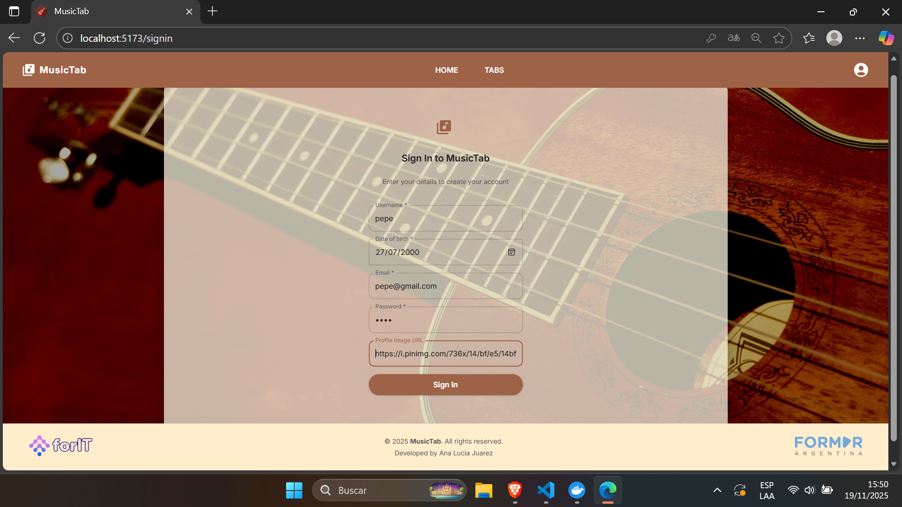
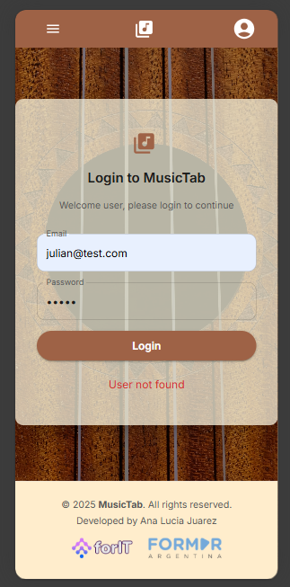

<section align="center">
    
</section>


## Index

* [Live demo (ver online)](#live-demo)
* [Overview](#overview)
* [Technologies](#technologies)
* [Pua (AI copilot)](#pua-ai-copilot)
* [Prerequisites](#prerequisites)
* [Project Installation](#project-installation)
    * [Running the Backend Locally](#running-the-backend-locally)
    * [Prisma Client generation](#prisma-client-generation)
    * [Running Backend Tests](#running-backend-tests)
    * [Running the Frontend Locally](#running-the-frontend-locally)
    * [Running Frontend Tests](#running-frontend-tests)
    * [Running Storybook](#running-storybook)
* [Docker Setup](#docker-setup)
* [Main Features](#main-features)
* [Screenshots](#screenshots)
* [Author](#author)
* [Production deployment](./docs/README_DEPLOY.md)

## Live demo

**[Ver online](https://musictab-4e9.pages.dev/)**

Deploy: **Cloudflare Pages** (frontend), **Render** (API), **Neon** (PostgreSQL).

## Overview
MusicTab is a **Yarn workspaces** monorepo for browsing, managing, and discovering **instrument tablature**.

It includes:

* A **NestJS 11** backend with **Prisma ORM** and a shared **TypeScript domain** package
* A **React 19 + Vite 7 + MUI** frontend
* **PostgreSQL 16** (Docker Compose locally)
* **Pua**, an in-app catalog assistant: **LangGraph** runs the flow, **LangChain** talks to **Google Gemini**, then TypeScript use-cases query the catalog (tabs are never invented)

## Technologies
## Backend
| Node.js | NestJS | TypeScript | Prisma ORM | PostgreSQL | ts-node | Jest / Vitest |
|:--:|:--:|:--:|:--:|:--:|:--:|:--:|
|  |  |  |  |  |  |  |

Also: **Zod** (structured LLM output), **JWT** sessions, **Cloudflare Turnstile** (server-side verify on register).

## Frontend
| React 19 | TypeScript | Vite 7 | Material UI | TanStack Query | Storybook | Vitest |
|:--:|:--:|:--:|:--:|:--:|:--:|:--:|
|  |  |  |  |  |  |  |

Also: **Axios**, **React Router 7**, **Cloudflare Turnstile** (Sign In)

## DevOps
| Docker | Docker Compose |
|:--:|:--:|
|  |  |

Local Compose runs API + Vite + Postgres.

## Pua (AI copilot)

**Pua** is MusicTab’s generative-AI catalog assistant (drawer chatbot). Guests are invited to log in; authenticated users can ask about artists, genres, instruments, views, and uploads in **English or Spanish**. 
The LLM classifies the question; **TypeScript domain use-cases** load rows from **PostgreSQL**; then the model (or a fixed template) phrases the answer.

| Layer | Language / library |
|--------|---------------------|
| API | **TypeScript**, **NestJS 11** (`CopilotModule`) |
| Orchestration | **LangGraph** (`@langchain/langgraph`) |
| LLM | **Google Gemini** via **LangChain** (`ChatGoogleGenerativeAI`) |
| Structured output | **Zod** |

Graph (all in TypeScript):

1. **`understand`** — Gemini + Zod: intent (search, counts, last viewed, quota, help, out of scope, …).
2. **`act`** — domain/Prisma queries; no LLM.
3. **`reply`** — Gemini writes 4–6 lines, or a template for some intents (`COPILOT_TEMPLATE_REPLY=true`).

Limits: **10 messages / user / day** (`America/Argentina/Buenos_Aires`) and **60 s** between successful sends; input max **100** characters. Set `GEMINI_API_KEY` in `apps/backend/.env` (see `.env.example`).

## Prerequisites

Before installing or running the project, ensure you have:

### Required Tools
* **Node.js** ($\ge$ 18; **20** recommended, matching the Dockerfiles)
* **Corepack** (ships with Node $\ge$ 16.10) — this repo pins **Yarn 4.10.3** (`packageManager` in the root `package.json`). Do not install classic Yarn globally.
* **npm** (for backend scripts such as `start:dev`)
* **Docker & Docker Compose** (required for local Postgres unless you point `DATABASE_URL` at another Postgres instance)
* **Git**
* **A code editor** like **VS Code**
* **Google AI Studio key** (optional locally, required for Pua) — `GEMINI_API_KEY`

On a **fresh clone** (including **Windows** / PowerShell), enable Yarn 4 before `yarn install`:

```bash
corepack enable
corepack prepare yarn@4.10.3 --activate
yarn -v
```

## Project Installation
### 1. Clone the repository
```bash
git clone https://github.com/manita02/MusicTab
cd MusicTab
```

### 2. Install root dependencies
```bash
yarn install
```

### 3. Install backend dependencies
```bash
cd apps/backend
npm install
```

### 4. Install frontend dependencies
```bash
cd ../frontend
yarn install
```

## Running the Backend Locally

Prisma uses **PostgreSQL**. Start a local instance (or put a Postgres URL in `apps/backend/.env`):

```bash
yarn db:up
```

Copy `apps/backend/.env.example` to `apps/backend/.env` if you do not have one yet. Fill **`GEMINI_API_KEY`** if you want Pua to answer. Then, from `apps/backend` (after `npm install` there):

```bash
cd apps/backend
npx prisma migrate deploy
npx prisma generate
npm run prisma:seed
```

| Field | Value |
|--------|--------|
| Username | `admin` |
| Email (login) | `admin@gmail.com` |
| Password | `admin` |

| Catalog | Values |
|--------|--------|
| Instruments | Guitar, Piano, Ukulele |
| Genres | Rock, Jazz, Pop, Blues, Metal, Folklore, Classical, Country, Reggae, Funk, Soul, R&B, Indie, Alternative, Punk, Latin, Flamenco, Soundtrack, Tango, Cumbia, Salsa, Milonga, Chacarera, Zamba, Chamamé, Cuarteto |

The login form uses **email**, not username.

Then start the API:

```bash
npm run start:dev
```

This script runs, in order: **`prisma:generate`** (Prisma Client), **`build:domain`** (shared domain package), then **`nest start --watch`**. The API listens by default at **http://localhost:3000**.

Other useful commands from the same folder:

| Command | Purpose |
|--------|---------|
| `npx prisma migrate deploy` | Apply existing migrations to Postgres |
| `npm run prisma:seed` | Create (or promote) the default admin user and seed instruments/genres |
| `npm run prisma:generate` | Regenerate the Prisma Client from `prisma/schema.prisma` |
| `npm run build` | Production build (`prebuild` runs Prisma + domain build first) |
| `npm run start:prod` | Migrate (optional seed if `SEED_ON_BOOT=true`) and run `dist/main` |

### Prisma Client generation

Nest imports `PrismaClient` from `@prisma/client`. That package is **not** complete until you run **`prisma generate`**, which writes the generated client under the workspace `node_modules` (for example `node_modules/@prisma/client` and `node_modules/.prisma/client` when dependencies are hoisted).

You should **not** see this in normal flow because `npm run start:dev` and `npm run build` already invoke **`npm run prisma:generate`** via the backend scripts.

If you still get:

```text
@prisma/client did not initialize yet. Please run "prisma generate"
```

typical causes are a fresh clone without having started the backend yet, removing `node_modules`, or clearing Prisma’s generated files. Fix it once from `apps/backend`:

```bash
npm run prisma:generate
```

After **any change** to `prisma/schema.prisma`, run `npm run prisma:generate` again (or rely on `start:dev` / `build`, which run it for you). The Docker image for the backend already runs `npx prisma generate` during the image build.

## Running Backend Tests

Domain package (**Vitest**):

```bash
cd domain
npm test
```

NestJS modules (**Jest**):

```bash
cd apps/backend
npm test
```

Copilot graph / quota specs (**Vitest**, `apps/backend/vitest.config.ts`):

```bash
cd apps/backend
npx vitest run
```

## Running the Frontend Locally
Copy `apps/frontend/.env.example` to `apps/frontend/.env` if needed (`VITE_API_URL` defaults to `http://localhost:3000`).

```bash
cd apps/frontend
yarn dev
```

Frontend will be available at: **http://localhost:5173**

## Running Frontend Tests
```bash
cd apps/frontend
yarn test
```

## Running Storybook
```bash
cd apps/frontend
yarn storybook
```

## Docker Setup
The project includes a `docker-compose.yaml` that runs **locally**:

* **Backend** (NestJS)
* **Frontend** (Vite)
* **PostgreSQL 16** (volume `pg-data`)

Compose does not inject `GEMINI_API_KEY`; for Pua, run the API with `apps/backend/.env` (`npm run start:dev`) or add the key to the `backend` service.

### Build and run everything
```bash
docker compose up --build
```

### Run without rebuilding
```bash
docker compose up
```

### Postgres only (for `npm run start:dev`)
```bash
yarn db:up
```

### Stop all containers
```bash
docker compose down
```

#### Services will be available at:

* **Frontend:** `http://localhost:5173`
* **Backend:** `http://localhost:3000`
* **Postgres:** `localhost:5432` (`musictab` / `musictab` / database `musictab`)

## Main Features

- **User Authentication**
  - User **sign up** and **sign in**
  - JWT-based sessions validated on the server (with Prisma `Session` records)
  - **Cloudflare Turnstile** on registration
  - Protected routes require a valid `Authorization: Bearer` token

- **User Account Management**
  - Authenticated users can **update** or **delete only their own** profile (`PUT` / `DELETE /users/:id` must match the logged-in user)
  - Upload and update profile image

- **Roles & tab permissions (source of truth: backend)**
  - **Admin (`ADMIN`)** — Full tablature **CRUD**: create, edit, delete; browse all tabs; download PDFs; admin-only UI controls.
  - **Registered user (`USER`)** — Browse tabs with full details (including PDF links from authenticated APIs), **download** PDFs; **cannot** create, edit, or delete tabs or call admin mutation endpoints.
  - **Guest (not signed in)** — Can browse the **public** tab catalogue and see previews (YouTube embed via `youtubeVideoId`, cover image via a **same-origin proxy** so stored image URLs are not exposed in public JSON). **Download**, **create**, **edit**, and **delete** are disabled in the UI and blocked by the API for mutations; PDF is not returned on public list endpoints.

- **Tabs Management**
  - Tabs include YouTube link, preview image, PDF file, genre, and instrument
  - **Only admins** perform create / update / delete (domain rules + NestJS `RolesGuard`)
  - Public read endpoints: `GET /tabs/public`, `GET /tabs/latest/public`; authenticated listing: `GET /tabs`, `GET /tabs/latest`

- **Pua (AI copilot)**
  - Drawer chatbot for **logged-in** users; guests get **Go to login**
  - LangGraph + Gemini over catalog tools (search, counts, views, uploads)
  - Daily quota and send cooldown enforced on the API

- **Stats**
  - Personal and community views (`/stats`) for authenticated users

- **Filtering & Categorization**
  - Tabs categorized by **genre** and **instrument**
  - **“My tabs”** filter is available **only to admins** (they are the only role that can manage tabs)

- **Responsive UI**
  - Desktop and mobile layout
  - Route-level **lazy loading** for heavier pages (Home, Tabs, Login, Sign In, Stats)

- **Developer Experience**
  - API built with **NestJS + Prisma**; domain tests with **Vitest**; Nest tests with **Jest**
  - Frontend built with **React 19 + Vite 7 + MUI**
  - Storybook for isolated UI component development
  - Fully Dockerized with **Docker Compose** for local one-command startup

## Screenshots

### Desktop Views

| Home | New Tab | Delete Tab |
|:--:|:--:|:--:|
|  |  |  |

| Manage Users | Tabs Page | Sign In |
|:--:|:--:|:--:|
|  |  |  |


### Mobile View

| Mobile Login |
|:--:|
|  |


## Author
| [<br><sub>Ana Lucia Juarez</sub>](https://github.com/manita02) | 
| :---: |
